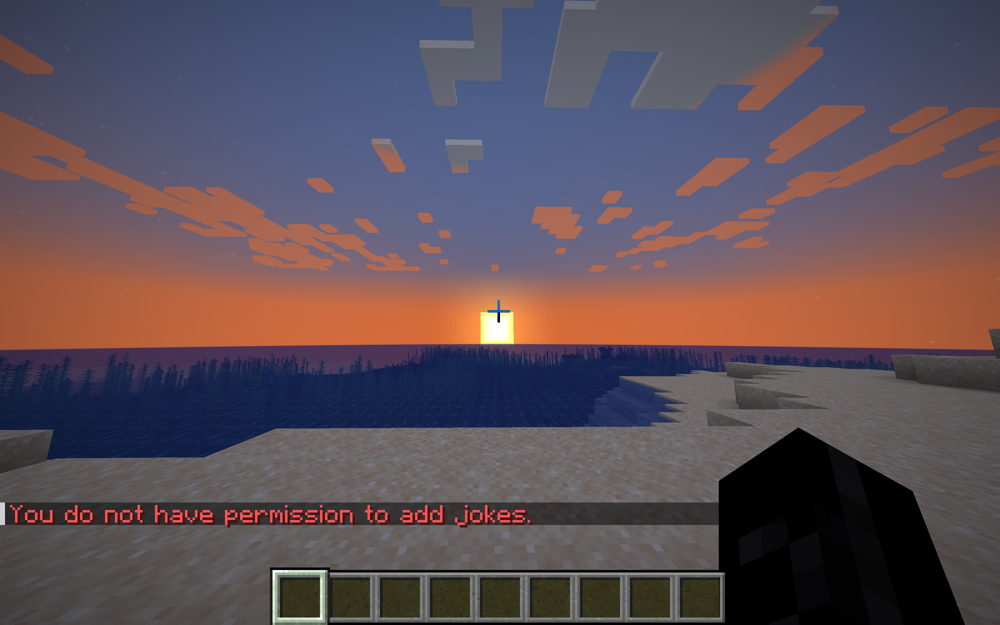

# JokesPlugin

**JokesPlugin** is a fun Minecraft plugin that allows players to interact with jokes, add new jokes, and enjoy a variety of humorous content within the game. The plugin also includes features like cooldowns, custom sounds, joke categories, and more to make the experience enjoyable for everyone!




## Features

- **/joke**: Get a random joke.
- **/joke add <joke>**: Add a new joke to the list.
- **Cooldown**: Custom cooldown for the `/joke` and `/joke add` commands to prevent spamming.
- **Permissions**: Control who can add jokes.

## Installation

1. Download the latest version of **JokesPlugin**.
2. Build the project.
3. Place the plugin `.jar` file into your server's `plugins/` folder.
4. Restart or reload your server.
5. (Optional) Modify the `config.yml` to configure jokes, cooldowns and sound effects.

## Configuration

### `config.yml`

```yaml
# Thanks for downloading JokesPlugin
jokes:
  - "Why don't skeletons fight each other? They don't have the guts!"
  - "Why did the Creeper cross the road? To blow up the chicken!"
  - "Knock knock. Who’s there? Cow says. Cow says who? No silly, cow says moo!"
  - "What do you call a Minecraft bed? A block of comfort!"
  - "Why did the chicken join Minecraft? To lay eggs in the game world!"
cooldown-seconds: 10
max-joke-length: 100
sounds:
  joke:
    type: ENTITY_VILLAGER_CELEBRATE
    volume: 1.0
    pitch: 1.0
  joke_add:
    type: ENTITY_PLAYER_LEVELUP
    volume: 1.0
    pitch: 1.0
